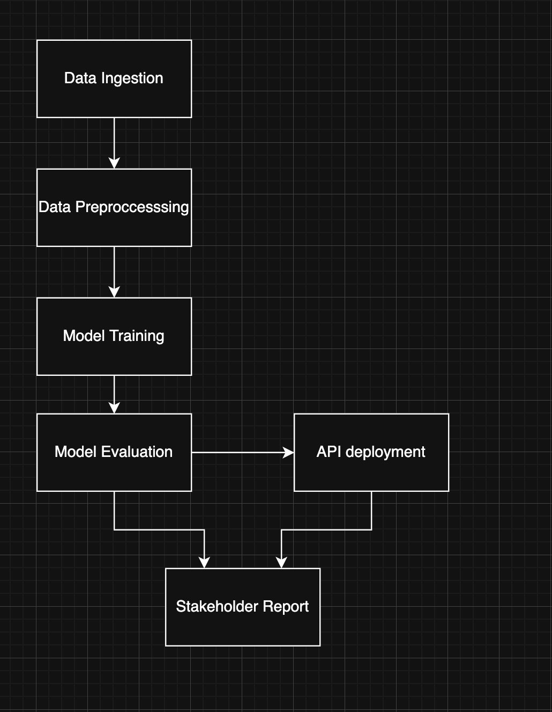

## Orchestration Plan for Fraud Detection Pipeline

### Core Pipeline Tasks:

1. **Data Ingestion** (`ingest_data`)

   - Input: Raw CSV files from data sources
   - Output: Validated raw data in `/data/raw/`
   - Idempotent: Yes (overwrites existing files with same data)
   - Checkpoint: `/checkpoints/ingestion_complete.txt` (timestamp + file count)

2. **Data Preprocessing** (`preprocess_data`)

   - Input: Raw data from ingestion
   - Output: Cleaned, feature-engineered data in `/data/processed/`
   - Idempotent: Yes (regenerates from raw)
   - Checkpoint: `/checkpoints/preprocessing_complete.txt` (timestamp + row count)

3. **Model Training** (`train_model`)

   - Input: Preprocessed data
   - Output: Trained model in `/model/model.pkl`
   - Idempotent: Yes (retrains and overwrites)
   - Checkpoint: `/checkpoints/training_complete.txt` (timestamp + model performance)

4. **Model Evaluation** (`evaluate_model`)

   - Input: Trained model + test data
   - Output: Performance metrics in `/reports/evaluation/`
   - Idempotent: Yes (regenerates metrics)
   - Checkpoint: `/checkpoints/evaluation_complete.txt` (timestamp + F1 score)

5. **API Deployment** (`deploy_api`)

   - Input: Trained model + Flask app
   - Output: Running API service
   - Idempotent: No (stops existing service)
   - Checkpoint: `/checkpoints/deployment_complete.txt` (timestamp + service status)

6. **Stakeholder Report Generation** (`generate_report`)
   - Input: Evaluation results + visualizations
   - Output: Final report in `/deliverables/`
   - Idempotent: No (Create separate report, not done automatically)
   - Checkpoint: `/checkpoints/report_complete.txt` (timestamp + report path)

## DAG

## Checkpoint Strategy (when implemented):

**Checkpoint Locations:** `/checkpoints/` directory
**Checkpoint Contents:**

- Completion timestamp
- Task-specific metadata (file counts, performance metrics, etc.)
- Success/failure status
- Cleanup after 30 days

**Resume Strategy:** Pipeline can restart from last successful checkpoint
**Health Monitoring:** File-based health checks for each checkpoint

## Failure Points

### Failure Points & Mitigations

- **Data Ingestion**: Missing/corrupt data.  
  _Mitigation_: Validate schema, retry, alert on failure.

- **Preprocessing**: Data cleaning/feature errors.  
  _Mitigation_: Log errors, validate output, checkpoint.

- **Model Training**: Training crashes, bad hyperparams.  
  _Mitigation_: Catch exceptions, log metrics, checkpoint.

- **Model Evaluation**: Metric calc fails, data mismatch.  
  _Mitigation_: Validate inputs, log errors, checkpoint.

- **API Deployment**: Service fails to start, port conflict.  
  _Mitigation_: Health checks, auto-restart, alert.

- **Report Generation**: Missing files, export errors.  
  _Mitigation_: Validate inputs, log/report errors.

## Automate Now (Immediate Value):

### Data Ingestion: Daily automated data pulls with validation

- Model Training: Weekly retraining with drift detection
- Model Evaluation: Automated performance monitoring
- API Health Checks: Continuous monitoring and restart
- These all spit out Numerical Values for performance or are an automatic test; easy to automate

### Keep Manual (Human Judgment Required):

- Data Quality Review: Manual inspection of new data sources
- Model Performance Analysis: Human review of evaluation results
- Stakeholder Report: Manual review before final delivery
- API Configuration Changes: Manual approval for production changes
- These are all either more sensitive like the API or require human in the loop to analyze changes (Stakeholder decisions, performance analysis, visual data analysis)
