## Credit Card Fraud Detection — Stage 12: Delivery Design

Date: 2025-08-28

### Executive Summary

- Data quality is high; aggressive cleaning risks removing rare-but-legit behavior.
- Class imbalance is severe; PR-focused metrics are the primary decision inputs.
- Scenario sensitivity shows baseline (100% data) best on PR AUC and F1; filtering adds complexity without benefit.
- Clear next steps: monitoring, threshold tuning, and retraining cadence.

### Problem Setup

- Objective: Detect fraudulent transactions with high recall while controlling false positives.
- Stakeholder: Financial institutions (decision-makers); end-users receive fraud alerts.
- Decision: Which preprocessing policy to adopt and what operating threshold to use.

### Methods

- Data: Kaggle credit card fraud (≈284K rows; `Time`, `V1..V28`, `Amount`, `Class`).
- Quality: 0 missing values in cleaned dataset; numeric and ready to model.
- Model: Logistic Regression (scaled), stratified train/test split, fixed random seed.
- Scenarios (sensitivity on `Amount` only):
  - Baseline (100% data)
  - Winsorized (clip 5–95%)
  - IQR-filtered (k = 1.5)
- Metrics: PR AUC (primary), F1, Precision, Recall; diagnostics via confusion matrix, residuals, and CIs.

### Key Charts with Takeaways

- Scenario Performance (Sensitivity)

  - F1 by Scenario: 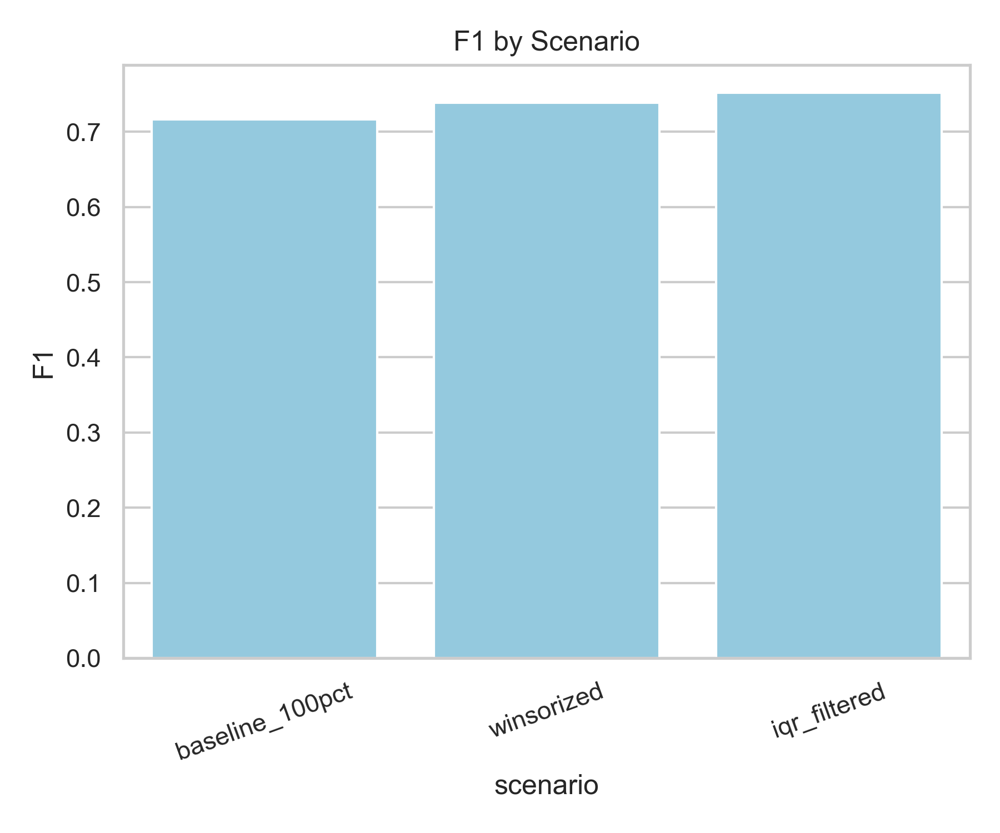
  Filtering slightly improves performance
  - PR AUC by Scenario: 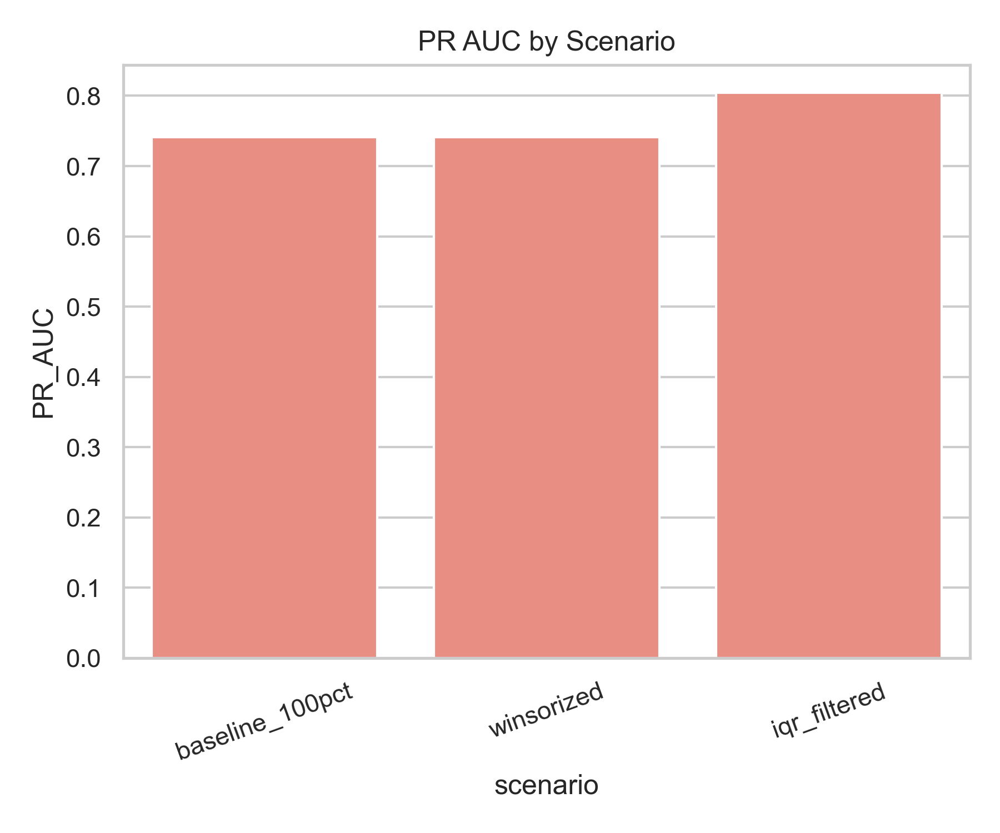
    Winsorization/IQR offer little performance boost, but risks in removing rare fraud patterns.
  - Scenario Fits (side-by-side): 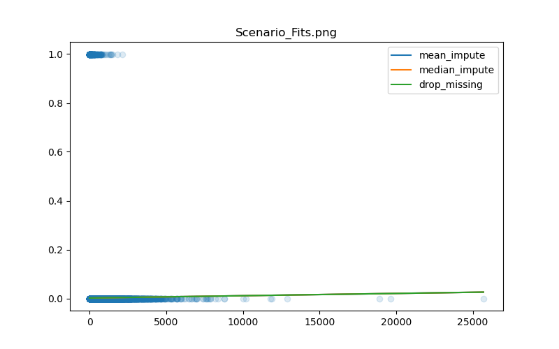
    Visual comparison supports keeping 100% data for best separation.

- Data Characteristics (Context)

  - Class Balance: 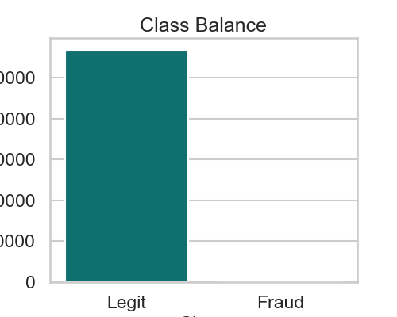
    Fraud is a tiny minority; evaluation must prioritize precision–recall trade-offs.
  - Amount Distribution (overall): 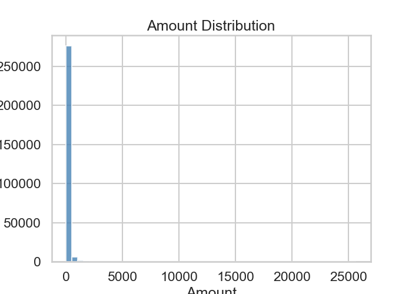
    Transactions span wide ranges; fraud occurs at small and large amounts.
  - Amount Histogram (zoomed perspective): 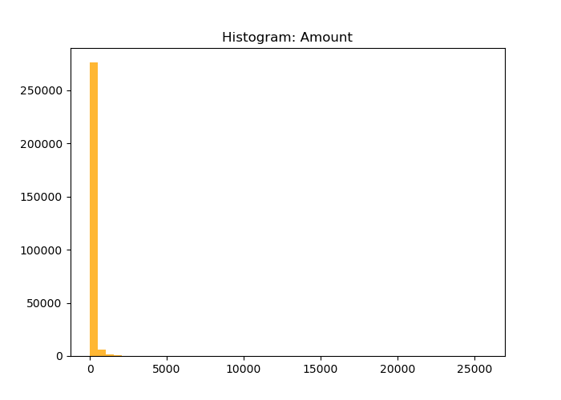
    Heavy right tail; informs robust scaling and threshold setting.
  - Amount Boxplot: 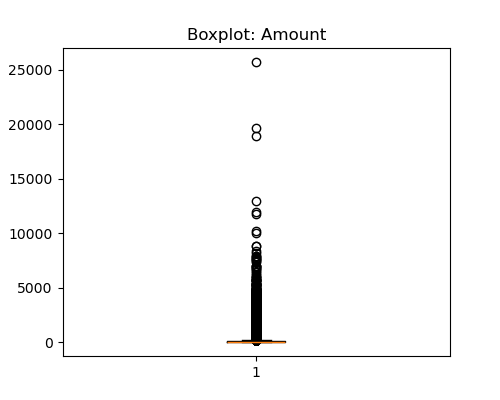
    Many statistical “outliers” are expected, not necessarily errors—avoid over-filtering.
  - Correlation Heatmap: 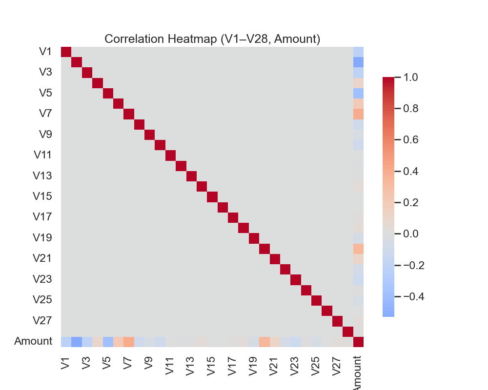
    Individual anonymized features have weak linear relationships; signal is multivariate.

- Model Diagnostics (Risk & Uncertainty)
  - Confusion Matrix: 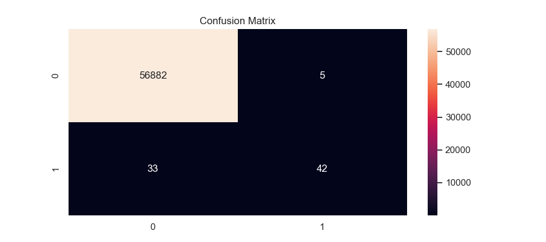
    Imbalance drives errors; threshold tuning is critical to control false positives.
  - Parametric vs Bootstrap CIs: 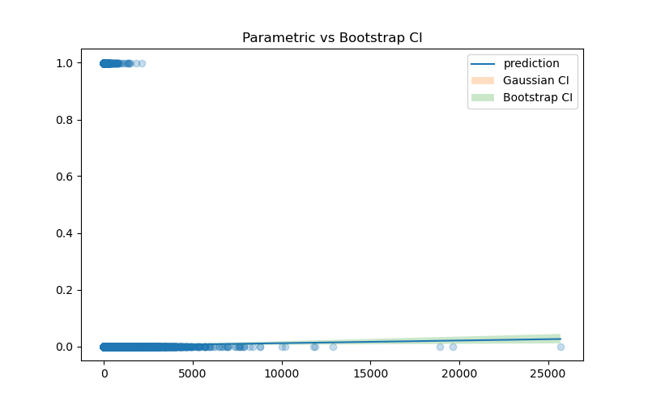
    Confidence intervals are consistent across methods → results are robust to CI approach.
  - Residuals by Segment: 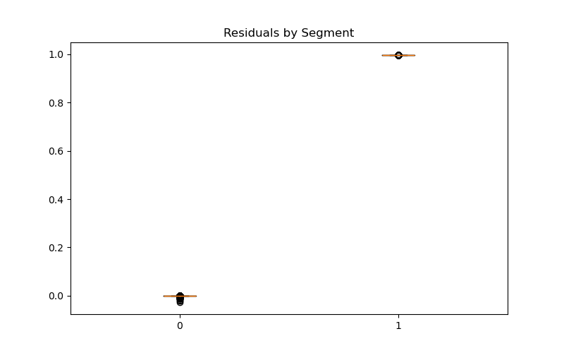
    Segment-level residuals show no pathological pattern; monitor for drift over time.

### Assumptions & Risks

- Assumptions
  - Data schema/quality remain stable; training and production distributions are comparable.
  - Fraud patterns evolve gradually; periodic retraining keeps pace.
  - `V1..V28` and `Amount` remain relevant indicators.
- Risks
  - Data or concept drift lowers recall/precision; alert fatigue if thresholds are mis-set.
  - Over-filtering removes legitimate but rare behaviors the model must learn.
- Mitigations
  - Automated data-quality and drift monitoring; scheduled retraining.
  - Threshold reviews using PR curves and operational review capacity.
  - Periodic feature/importance checks and stress tests.

### Alternate Scenario & Sensitivity

- Compared baseline vs winsorized vs IQR-filtered on `Amount`.
- Result: Baseline (100% data) consistently shows higher PR AUC and F1.
- Interpretation: High-quality data should be preserved; filtering harms detection of rare fraud patterns.

### Decision Implications

- Adopt baseline (100% data) with monitoring rather than aggressive cleaning.
- Tune operating threshold to meet target recall while controlling review workload.
- Use confusion matrix and PR metrics to set policy; review quarterly with drift checks.
- Lack of Tuning left to low F1 scores; optimize with other algorithms for better recall

### Next Steps

- Implement monitoring: missingness, schema, range checks, and drift metrics.
- Establish retraining cadence (e.g., monthly or trigger-based on drift).
- Run threshold sweep to align with business KPIs (review capacity, fraud loss).
- Track PR AUC/F1 weekly; escalate when metrics deviate from control bands.

### References to Code

- Stakeholder scenarios: `project/notebooks/result_report_stakeholder.ipynb`
- EDA & distributions: `project/notebooks/exploratory_data_analysis.ipynb`
- Classification & diagnostics: `project/notebooks/time-series-classification.ipynb`
- Outliers & sensitivity: `project/notebooks/outlier_risk_analysis.ipynb`
